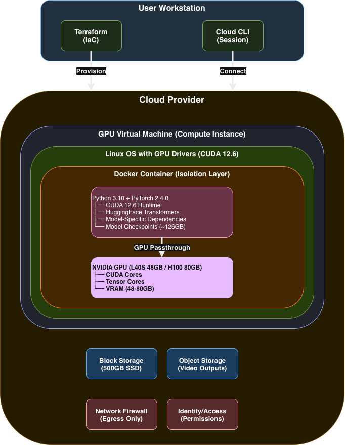

# 🎬 Video Generation Infrastructure

> Infrastructure as Code (IaC) for deploying large-scale open-source video generation models using Terraform and Docker on cloud platforms.

<br>

---

## 📑 Table of Contents

- [Overview](#overview)
- [Quick Start](#quick-start)
  - [Prerequisites](#prerequisites)
  - [Provision Infrastructure](#1-provision-infrastructure)
  - [Connect to GPU Instance](#2-connect-to-gpu-instance)
  - [Deploy Model Container](#3-deploy-model-container)
- [Architecture](#architecture)
- [Technologies](#technologies)
- [Foundation Knowledge](#foundation-knowledge)
- [References](#references)

<br>

---

## 🔍 Overview

This project provides automated cloud infrastructure provisioning for running state-of-the-art video generation models that require enterprise-grade GPU resources. It uses Terraform to provision GPU-accelerated virtual machines and Docker to containerize inference environments, enabling researchers and developers to deploy models like Wan2.2 and HunyuanVideo without manual server configuration.

### 🎯 Supported Models

| Model | Parameters | Capabilities |
|-------|-----------|--------------|
| **Wan2.2** | 14B (MoE) | Text-to-Video (T2V) & Image-to-Video (I2V) |
| **HunyuanVideo** | 13B | Text-to-Video (T2V) & Image-to-Video (I2V) |

### ✨ Key Features

- ✅ **Reproducible deployment** through declarative infrastructure code
- 🔒 **Isolated runtime environments** with containerization
- 🤖 **Automated dependency resolution** and environment setup
- 🎛️ **Flexible GPU resource allocation** for varying model requirements
- 📝 **Version-controlled infrastructure** enabling collaborative research
- ⚡ **Rapid iteration** through infrastructure-as-code patterns

<br>

---

## 🚀 Quick Start

### ⚙️ Prerequisites

> **Required Setup**
> - ☁️ Cloud provider account with GPU compute and object storage access
> - 🔑 Cloud CLI configured with valid credentials
> - 🔧 Terraform ≥5.0 installed
> - 📚 Basic understanding of Terraform, Docker, and cloud infrastructure

### 1️⃣ Provision Infrastructure

<details>
<summary><b>Terraform Deployment Steps</b></summary>

```bash
cd terraform

# Configure deployment parameters
nano variables.tf  # Set: instance_type, storage_bucket_name, region

# Initialize and deploy
terraform init
terraform plan
terraform apply  # Provisions resources (~5-10 minutes)
```

> **✅ Success Indicator**: Terraform will output the instance identifier and remote connection command.

</details>

<br>

### 2️⃣ Connect to GPU Instance

<details>
<summary><b>Instance Connection & Verification</b></summary>

```bash
# Connect via secure session manager (implementation varies by provider)
# Example: aws ssm start-session --target <instance-id>

# Verify GPU availability
nvidia-smi
```

> **💡 Tip**: You should see your GPU listed (e.g., L40S or H100) with available VRAM.

</details>

<br>

### 3️⃣ Deploy Model Container

#### 📥 Initial Setup

```bash
cd /opt
sudo git clone https://github.com/brandonmandzik/TODO.git
```

#### 🎨 For Wan2.2

<details>
<summary><b>Wan2.2 Setup & Inference</b></summary>

```bash
cd /opt/infrastructure/wan22

# Configure Docker image
cp .env.example .env
nano .env  # Set DOCKER_IMAGE to your registry

# OPTIONAL: Build own container
./build-and-push.sh

# Start container
./run.sh
docker attach wan22-inference
```

**Download Model Weights** (~126GB)
```bash
./download_model.sh
```

**Run Inference**
```bash
cd wan2.2
python3 generate.py \
  --task t2v-A14B \
  --size 1280*720 \
  --ckpt_dir /workspace/wan2.2/checkpoints/Wan2.2-T2V-A14B \
  --offload_model True \
  --convert_model_dtype \
  --t5_cpu \
  --prompt "Your video description"
```

> **⚠️ Note**: Download time depends on network speed. Requires ~126GB free space.

</details>

<br>

#### 🌟 For HunyuanVideo

<details>
<summary><b>HunyuanVideo Setup & Inference</b></summary>

**Container Setup**
```bash
cd /opt/infrastructure/hunyuanvideo
./run-t2v.sh
docker attach hunyuanvideo

git clone https://github.com/Tencent-Hunyuan/HunyuanVideo.git
cd HunyuanVideo
```

**Install Dependencies**
```bash
python -m pip install "huggingface_hub[cli]"
```

**Download Models** (Total: ~57GB)
```bash
# Main model (~40 GB)
hf download tencent/HunyuanVideo --local-dir ./ckpts

# Text encoder (LLaVA-Llama-3-8B)
cd ckpts
hf download xtuner/llava-llama-3-8b-v1_1-transformers \
  --local-dir ./llava-llama-3-8b-v1_1-transformers
```

**Preprocess Text Encoder**
```bash
cd ..
python hyvideo/utils/preprocess_text_encoder_tokenizer_utils.py \
  --input_dir ckpts/llava-llama-3-8b-v1_1-transformers \
  --output_dir ckpts/text_encoder
```

**Download Secondary Text Encoder (CLIP)**
```bash
cd ckpts
hf download openai/clip-vit-large-patch14 --local-dir ./text_encoder_2
```

**Run Inference**
```bash
cd HunyuanVideo
python3 sample_video.py \
  --video-size 720 1280 \
  --video-length 129 \
  --infer-steps 50 \
  --prompt "Your video description" \
  --use-cpu-offload \
  --save-path ./results
```

> **💡 Tip**: Results will be saved to `./results` directory inside the container.

</details>

<br>

---

## 🏗️ Architecture

### 📐 High-Level Overview

The infrastructure follows a cloud-native IaC pattern where Terraform provisions cloud resources (compute, networking, storage, identity management) and Docker encapsulates the runtime environment (GPU drivers, ML frameworks, model code). This separation enables reproducible deployments across different cloud providers with minimal code changes.

**Architecture Diagram**:

<p align="center">
  
</p>

<br>

### 🔧 Infrastructure Layers

#### 1️⃣ IaC Layer (Terraform)

Terraform manages all cloud resources declaratively:

| Component | Description |
|-----------|-------------|
| **Compute Instance** | GPU-accelerated VM with enterprise GPU hardware |
| **Identity/Access Management** | Service identity with session management and storage permissions |
| **Network Firewall** | Egress-only rules (no inbound SSH, secure HTTPS sessions) |
| **Block Storage** | 500GB SSD volume for model checkpoints |
| **Machine Image** | Pre-configured OS with GPU drivers (CUDA 12.6) and Docker |

**Configuration Files**:
- 📄 `terraform/main.tf` - Resource definitions (compute, identity, network, storage)
- 📄 `terraform/variables.tf` - Deployment parameters (instance type, region, bucket)
- 📄 `terraform/outputs.tf` - Post-deployment info (instance ID, connection command)
- 📄 `terraform/user_data.sh` - Bootstrap script executed on first boot

<br>

#### 2️⃣ Compute Layer (GPU Virtual Machine)

Cloud provider supplies on-demand access to enterprise NVIDIA GPUs:

**GPU Options**:
| GPU Model | VRAM | TDP | Architecture | Compute Capability |
|-----------|------|-----|--------------|-------------------|
| **NVIDIA L40S** | 48GB | 300W | Ada Lovelace | 8.9 |
| **NVIDIA H100** | 80GB | 700W | Hopper | 9.0 |

**System Configuration**:
- 🐧 **OS**: Ubuntu 22.04 LTS
- 🎮 **Drivers**: NVIDIA 535+ with CUDA 12.6
- 🚀 **Bootstrap**: Auto-installs container tools, configures permissions, validates GPU passthrough

<br>

#### 3️⃣ Container Layer (Docker)

Docker encapsulates the complete inference stack with GPU passthrough and reproducible dependencies:

**Base Images**:
| Model | Image | Source |
|-------|-------|--------|
| **Wan2.2** | `TODO` | Custom-built |
| **HunyuanVideo** | `hunyuanvideo/hunyuanvideo:cuda_12` | Vendor-supplied |

**Runtime Configuration**:
- 🎮 **GPU Runtime**: CUDA 12.x with `--gpus all --privileged` for kernel-level access
- 🌐 **Networking**: Host mode (`--net=host`) eliminates network overhead
- 💾 **Memory**: Unlimited locked memory (`ulimit memlock=-1`), 64MB stack
- 🔄 **IPC**: Shared host IPC (`--ipc=host`) for multi-GPU coordination
- ⚡ **Flash Attention**: Kernel compilation for compute capabilities 8.9/9.0
- 📦 **Dependencies**: Pre-installed inference libraries, text encoders, VAE decoders

**Lifecycle**:
- ▶️ Containers run as interactive daemons with persistent state
- 📥 Model checkpoints downloaded post-launch via HuggingFace CLI
- 💾 Outputs written to bind-mounted host volumes (`/opt/outputs`)

<br>

#### 4️⃣ Application Layer (Python + ML Frameworks)

This layer executes inference workloads by orchestrating GPU compute, memory management, and model serving:

**Core Frameworks**:
| Framework | Version | Purpose |
|-----------|---------|---------|
| **PyTorch** | 2.4.0+ | Tensor operations, autodiff, CUDA kernel dispatch |
| **CUDA** | 12.x | GPU memory allocation, kernel scheduling, multi-stream execution |
| **Flash Attention** | 2.x | Fused attention kernels (2-4× throughput gains) |

**Model Inference Pipeline**:
1. 📝 **Text Encoding** - Transformers (T5, LLaVA-Llama-3-8B, CLIP ViT-L/14) convert prompts to embeddings
2. 🎨 **Latent Diffusion** - Iterative denoising with diffusion transformers + MoE routing
3. 🖼️ **VAE Decoding** - Upsample latents to pixel-space video frames with temporal consistency
4. 💾 **Memory Optimization** - CPU offloading, mixed-precision (FP16/BF16), dynamic allocation

**Model Checkpoints** (downloaded at runtime):
| Model | Size | Parameters | Active Parameters |
|-------|------|------------|------------------|
| Wan2.2-T2V-A14B | ~126GB | 27B | 14B per step |
| Wan2.2-I2V-A14B | ~126GB | 27B | 14B per step |
| HunyuanVideo-T2V | ~57GB | 13B+ | — |
| HunyuanVideo-I2V | ~62GB | 13B+ | — |

<br>

### ⚙️ Hardware Requirements

Both models require enterprise-grade GPU hardware with substantial memory capacity:

> **💾 Peak Memory Requirements**
> - **Standard configuration**: ~60GB VRAM
> - **Optimized configuration**: ~40GB VRAM (with model offloading, CPU text encoding, mixed precision)

<br>

**Why Enterprise GPUs?**

<table>
<tr>
<td width="25%"><b>🧠 High Memory Capacity</b></td>
<td>48-80GB VRAM loads multi-billion parameter models entirely in GPU memory, eliminating CPU-GPU transfer bottlenecks (vs. 8-24GB consumer GPUs)</td>
</tr>
<tr>
<td><b>⚡ Tensor Cores</b></td>
<td>Specialized hardware for matrix multiplication delivering 5-10× performance for FP16/BF16 computation, directly accelerating transformer attention</td>
</tr>
<tr>
<td><b>🚄 Memory Bandwidth</b></td>
<td>2-3 TB/s bandwidth (vs. 1 TB/s consumer) reduces memory-bound bottlenecks during weight loading and activation transfers</td>
</tr>
<tr>
<td><b>✅ ECC Memory</b></td>
<td>Error-correcting memory ensures computational accuracy during extended inference runs for research reproducibility</td>
</tr>
<tr>
<td><b>🔀 Multi-Instance GPU</b></td>
<td>Hardware partitioning allows multiple isolated workloads on a single GPU for efficient resource utilization</td>
</tr>
</table>

> **🚀 Performance Impact**: Enterprise GPUs are 50-100× faster than CPU-based inference and essential for practical research with billion-parameter diffusion models.

<br>

### ☁️ Cloud Provider Implementation

This project uses cloud infrastructure to provide:

| Capability | Benefit |
|------------|---------|
| 🎮 **GPU Compute** | On-demand access to enterprise GPUs without capital investment |
| 📦 **Object Storage** | Scalable storage for video outputs and artifacts |
| 💽 **Block Storage** | High-performance SSD volumes for model checkpoints |
| 🔐 **Identity Management** | Service-to-service authentication and authorization |
| 🔒 **Secure Remote Access** | Session management without exposed network ports |
| 🛡️ **Network Isolation** | Egress-only firewalling for security |

<br>

### 🗺️ Technology-to-Product Mapping (AWS Implementation)

The current implementation uses AWS services as wrappers for underlying technologies:

| Technology | Purpose | AWS Product | Alternative Providers |
|-----------|---------|-------------|----------------------|
| **GPU Virtual Machine** | Compute instance with GPU passthrough | EC2 (g6e.4xlarge, p5.4xlarge) | GCP: Compute Engine (a2-highgpu-1g)<br>Azure: Virtual Machines (NC A100 v4)<br>Oracle: Compute (GPU.A10) |
| **Block Storage** | High-speed SSD for model weights | EBS (gp3) | GCP: Persistent Disk (SSD)<br>Azure: Managed Disks (Premium SSD)<br>Oracle: Block Volume |
| **Object Storage** | Scalable video output storage | S3 | GCP: Cloud Storage (GCS)<br>Azure: Blob Storage<br>Oracle: Object Storage |
| **Identity/Access Management** | Permission policies | IAM Roles/Policies | GCP: Cloud IAM<br>Azure: RBAC<br>Oracle: IAM Policies |
| **Secure Remote Session** | SSH-less remote access | Systems Manager (SSM) | GCP: Cloud Shell/IAP<br>Azure: Bastion<br>SSH with key management |
| **Network Firewall** | Stateful packet filtering | Security Groups | GCP: Firewall Rules<br>Azure: Network Security Groups<br>Oracle: Security Lists |
| **Pre-configured Image** | OS + GPU drivers + Docker | Deep Learning AMI | GCP: Deep Learning VM Image<br>Azure: Data Science VM<br>Custom image with NVIDIA drivers |

### 🌐 Cloud-Agnostic Design

The architecture separates provider-specific infrastructure (Terraform) from provider-agnostic runtime (Docker):

| Layer | Multi-Cloud Strategy |
|-------|---------------------|
| **Infrastructure Layer** | Swap Terraform provider module (`aws` → `google`/`azurerm`/`oci`) |
| **Container Layer** | Docker images remain identical across all cloud providers |
| **Application Layer** | Python inference code is provider-agnostic |

> **✨ Portability**: Multi-cloud deployments require minimal code changes (typically <50 lines of Terraform modifications).

<br>

---

## 🛠️ Technologies

### 📋 Infrastructure as Code (Terraform)

**Purpose**: Declarative infrastructure provisioning

**Functionality**: Reads `.tf` configuration files and translates them into cloud provider API calls to create/update/destroy resources. Maintains state file to track resource lifecycle and dependencies. Enables version-controlled, repeatable deployments.

**Key Resource Types**:
- 🖥️ **Compute instances** - VMs with specified image, type, and initialization scripts
- 🛡️ **Network firewalls** - Stateful packet filters with ingress/egress rules
- 🔑 **Identity roles** - Service identities with trust policies and permission attachments
- 💾 **Storage volumes** - Block and object storage with configurable capacity and performance

<br>

### 🐳 Containerization (Docker)

**Purpose**: Application isolation and dependency encapsulation

**Functionality**: Creates lightweight OS-level virtualization using Linux namespaces and cgroups. Docker images bundle application code, libraries, and dependencies into portable artifacts. Containers run as isolated processes with dedicated filesystems, network stacks, and resource limits.

**Key Features**:
| Flag | Purpose |
|------|---------|
| `--gpus all` | NVIDIA Container Toolkit integration for GPU passthrough |
| `--ipc host` | Shared memory access for PyTorch DataLoader multi-processing |
| `--privileged` | Full device access for CUDA runtime |
| Volume mounts | Persistent storage for model checkpoints (`/workspace/wan2.2/checkpoints`) |

<br>

### 🔒 Secure Session Management

**Purpose**: Remote instance access without exposed network ports

**Functionality**: Agent-based service that establishes encrypted connections to cloud provider management endpoints. Enables shell access without inbound firewall rules, SSH key management, or public IP addresses. Sessions are logged for audit compliance.

**Advantages over traditional SSH**:
| Feature | Benefit |
|---------|---------|
| 🔑 **No key management** | Eliminates rotation overhead |
| 🛡️ **No exposed ports** | Zero brute-force attack surface |
| 🎯 **Centralized control** | Access control via identity policies |
| 📝 **Session recording** | Full audit logs |

<br>

### 💿 Pre-configured Machine Images

**Purpose**: GPU-ready operating system environment

**Functionality**: Ubuntu 22.04 LTS image with pre-installed NVIDIA drivers, CUDA toolkit, cuDNN libraries, Docker runtime, and NVIDIA Container Toolkit. Eliminates manual driver compilation and version incompatibility issues.

**Pre-installed Software Stack**:
| Component | Version | Details |
|-----------|---------|---------|
| **NVIDIA Driver** | 535+ | R535 production branch |
| **CUDA Toolkit** | 12.6.1 | Compiler, profiler, libraries |
| **Docker** | 27.x | NVIDIA runtime integration |
| **Cloud CLI** | Latest | Provider-specific management tools |

<br>

### 🎮 NVIDIA CUDA

**Purpose**: GPU parallel computing platform

**Functionality**: Low-level API for launching GPU kernels (parallel functions). Provides BLAS, FFT, and cuDNN libraries for optimized matrix operations. PyTorch compiles operations into CUDA kernels at runtime, transparently offloading computation to GPU cores.

**Key Libraries**:
- 🔢 **cuBLAS** - GPU-accelerated matrix multiplication (transformer attention)
- 🧠 **cuDNN** - Optimized convolution, pooling, activation functions (VAE)
- 🔗 **NCCL** - Multi-GPU communication (not used in single-GPU setup)

<br>

### 🔥 PyTorch

**Purpose**: Deep learning framework

**Functionality**: Python library that provides automatic differentiation (gradients), GPU tensor operations, and neural network modules. Models define forward passes using PyTorch primitives (`nn.Linear`, `nn.Conv2d`), and PyTorch compiles them into optimized CUDA kernels.

**Key Features**:
- 📊 **Dynamic computation graphs** - Define-by-run execution
- ⚡ **Automatic mixed precision (AMP)** - FP16 training
- 🚀 **TorchScript JIT** - Production inference compilation
- 💾 **CUDA memory management** - `torch.cuda.empty_cache()`

<br>

### ⚡ Flash Attention

**Purpose**: Memory-efficient attention mechanism

**Functionality**: Optimized attention implementation that reduces VRAM usage from O(N²) to O(N) by fusing operations and using tiled block-wise computation. Provides 2-4× speedup for long-sequence transformers without approximation.

**Technical Details**:
- ✅ Compiled as CUDA kernel for compute capabilities 8.9 (L40S) and 9.0 (H100)
- 📦 Installed via `pip install flash-attn` with `TORCH_CUDA_ARCH_LIST="8.9;9.0"`
- 🔄 Automatically replaces standard PyTorch attention when imported

<br>

### 🤗 HuggingFace Transformers

**Purpose**: Model zoo and tokenization library

**Functionality**: Provides pre-trained model architectures (T5, CLIP, LLaMA) and tokenizers. `hf download` CLI downloads model weights from HuggingFace Hub. Models are loaded via `AutoModel.from_pretrained()`.

**Key Components**:
- 🌐 **Model hub** - 500,000+ pre-trained models (huggingface.co/models)
- 🔤 **Tokenizers** - Text→token conversion (BPE, WordPiece, SentencePiece)
- 📚 **Model classes** - `T5EncoderModel`, `CLIPTextModel`, etc.

<br>

### 🎯 Model-Specific Technologies

<details>
<summary><b>🎨 Wan2.2 Technical Details</b></summary>

| Component | Specification |
|-----------|--------------|
| **Architecture** | Mixture-of-Experts (MoE) diffusion transformer (14B params) |
| **Text Encoder** | T5 encoder with CPU offloading support |
| **VAE** | Standard latent diffusion VAE (TI2V-5B uses Wan2.2-VAE with 16×16×4 compression) |
| **Sampling** | MoE-based denoising with specialized experts, 480P/720P generation |

</details>

<details>
<summary><b>🌟 HunyuanVideo Technical Details</b></summary>

| Component | Specification |
|-----------|--------------|
| **Architecture** | Dual-stream to single-stream hybrid diffusion transformer (13B+ params) |
| **Text Encoder** | MLLM with decoder-only structure + bidirectional token refiner + Prompt Rewrite Model |
| **VAE** | 3D VAE with CausalConv3D (4× temporal, 8× spatial, 16× channel compression) |
| **Sampling** | Flow matching with embedded CFG (scale: 6.0, flow shift: 7.0) |

</details>

<br>

---

## 📚 Foundation Knowledge

To understand this project's architecture, implementation, and technologies, the following foundational knowledge is recommended:

<details>
<summary><b>🏗️ Core Infrastructure Concepts</b></summary>

### 1. Infrastructure as Code (IaC)
- Declarative vs. imperative configuration management
- State management and resource lifecycle (create, read, update, delete)
- Idempotency and drift detection
- 📖 [Terraform Intro](https://developer.hashicorp.com/terraform/intro), [IaC Patterns](https://www.oreilly.com/library/view/infrastructure-as-code/9781098114664/)

### 2. Cloud Computing Fundamentals
- Virtual machines vs. bare-metal servers
- Block storage vs. object storage
- Identity permission models (roles, policies, principals)
- VPC networking (security groups, subnets, route tables)
- 📖 [AWS Well-Architected Framework](https://aws.amazon.com/architecture/well-architected/), [Cloud Computing Concepts](https://www.coursera.org/learn/cloud-computing)

### 3. Containerization
- Linux namespaces and cgroups
- Container images vs. containers (build-time vs. runtime)
- Docker layered filesystem (UnionFS)
- GPU passthrough with NVIDIA Container Toolkit
- 📖 [Docker Deep Dive](https://www.oreilly.com/library/view/docker-deep-dive/9781800565135/), [NVIDIA Container Toolkit Docs](https://docs.nvidia.com/datacenter/cloud-native/container-toolkit/)

</details>

<details>
<summary><b>🎮 GPU Computing Concepts</b></summary>

### 4. CUDA Programming Model
- GPU architecture (CUDA cores, tensor cores, memory hierarchy)
- Kernel launching and thread blocks
- VRAM vs. system memory
- CUDA libraries (cuBLAS, cuDNN, NCCL)
- 📖 [CUDA C++ Programming Guide](https://docs.nvidia.com/cuda/cuda-c-programming-guide/), [GPU Computing Gems](https://www.elsevier.com/books/gpu-computing-gems-emerald-edition/hwu/978-0-12-384988-5)

### 5. Deep Learning Hardware
- Tensor Cores for matrix multiplication (FP16/BF16/FP8 support)
- Memory bandwidth bottlenecks (compute-bound vs. memory-bound operations)
- Mixed precision training (FP16 computation with FP32 accumulation)
- Model parallelism vs. data parallelism
- 📖 [Making Deep Learning Go Brrrr](https://horace.io/brrr_intro.html), [NVIDIA A100 Whitepaper](https://www.nvidia.com/content/dam/en-zz/Solutions/Data-Center/a100/pdf/nvidia-a100-datasheet.pdf)

</details>

<details>
<summary><b>🧠 Machine Learning Foundations</b></summary>

### 6. Deep Learning Fundamentals
- Neural network architectures (CNNs, transformers, attention mechanisms)
- Backpropagation and gradient descent
- Loss functions and optimization (Adam, AdamW)
- Regularization techniques (dropout, layer normalization)
- 📖 [Deep Learning Book](https://www.deeplearningbook.org/), [Stanford CS231n](http://cs231n.stanford.edu/)

### 7. Diffusion Models
- Forward diffusion process (adding noise)
- Reverse diffusion process (denoising)
- Noise scheduling and sampling strategies (DDPM, DDIM)
- Latent diffusion and VAEs (Variational Autoencoders)
- 📖 [Denoising Diffusion Probabilistic Models](https://arxiv.org/abs/2006.11239), [High-Resolution Image Synthesis with Latent Diffusion Models](https://arxiv.org/abs/2112.10752)

### 8. Transformer Architectures
- Self-attention mechanism (Q, K, V matrices)
- Multi-head attention and positional encodings
- Memory complexity (O(N²) attention bottleneck)
- Vision transformers and temporal transformers
- 📖 [Attention Is All You Need](https://arxiv.org/abs/1706.03762), [The Illustrated Transformer](http://jalammar.github.io/illustrated-transformer/)

</details>

<br>

---

## 📖 References

<details>
<summary><b>🎨 Model Papers and Documentation</b></summary>

### Wan2.2
- 📁 [GitHub Repository](https://github.com/Wan-Video/Wan2.2) - Official implementation, setup instructions, inference scripts
- 📄 [Technical Paper](https://arxiv.org/pdf/2503.20314) - Architecture details, training methodology, benchmarks
- 🤗 [HuggingFace T2V Model](https://huggingface.co/Wan-AI/Wan2.2-T2V-A14B) - Pre-trained text-to-video weights (~126GB)
- 🤗 [HuggingFace I2V Model](https://huggingface.co/Wan-AI/Wan2.2-I2V-A14B) - Pre-trained image-to-video weights (~126GB)

### HunyuanVideo
- 📁 [GitHub T2V Repository](https://github.com/Tencent-Hunyuan/HunyuanVideo) - Text-to-video implementation
- 📁 [GitHub I2V Repository](https://github.com/Tencent-Hunyuan/HunyuanVideo-I2V) - Image-to-video implementation
- 📄 [Technical Paper](https://arxiv.org/abs/2412.03603) - Model architecture and training details
- 🤗 [HuggingFace Model Hub](https://huggingface.co/tencent/HunyuanVideo) - Pre-trained checkpoints

</details>

<details>
<summary><b>☁️ Infrastructure and DevOps</b></summary>

### AWS Services
- 📘 [Deep Learning AMI Release Notes](https://aws.amazon.com/releasenotes/aws-deep-learning-base-oss-nvidia-driver-gpu-ami-ubuntu-22-04/) - AMI changelog, driver versions
- 🖥️ [EC2 GPU Instances](https://aws.amazon.com/ec2/instance-types/#Accelerated_Computing) - Instance type comparison and pricing
- 🔐 [IAM Best Practices](https://docs.aws.amazon.com/IAM/latest/UserGuide/best-practices.html) - Security recommendations

### Terraform
- 📚 [Terraform AWS Provider](https://registry.terraform.io/providers/hashicorp/aws/latest/docs) - Resource documentation and examples
- 📖 [Terraform Language Reference](https://developer.hashicorp.com/terraform/language) - HCL syntax and built-in functions
- ✨ [Terraform Best Practices](https://www.terraform-best-practices.com/) - Community style guide

### Docker and GPU Support
- 🐳 [Docker Compose GPU Support](https://docs.docker.com/compose/how-tos/gpu-support/) - GPU device configuration
- 🎮 [NVIDIA Container Toolkit](https://docs.nvidia.com/datacenter/cloud-native/container-toolkit/) - GPU passthrough setup
- 📋 [Docker Best Practices](https://docs.docker.com/develop/dev-best-practices/) - Dockerfile optimization

</details>

<details>
<summary><b>🔥 Machine Learning Frameworks</b></summary>

### PyTorch
- 📚 [PyTorch Documentation](https://pytorch.org/docs/stable/index.html) - API reference and tutorials
- 🎮 [PyTorch CUDA Semantics](https://pytorch.org/docs/stable/notes/cuda.html) - GPU memory management
- ⚡ [PyTorch Performance Tuning](https://pytorch.org/tutorials/recipes/recipes/tuning_guide.html) - Profiling and optimization

### HuggingFace
- 🤗 [Transformers Documentation](https://huggingface.co/docs/transformers/index) - Model loading and tokenization
- 📦 [Hub Python Library](https://huggingface.co/docs/huggingface_hub/index) - Downloading models with `hf download`
- ⚡ [Flash Attention](https://github.com/Dao-AILab/flash-attention) - Memory-efficient attention

</details>

<details>
<summary><b>🎨 Diffusion Model Theory</b></summary>

- 📄 [DDPM](https://arxiv.org/abs/2006.11239) - Original diffusion model paper (Ho et al., 2020)
- 📄 [DDIM](https://arxiv.org/abs/2010.02502) - Faster sampling strategy (Song et al., 2020)
- 📄 [Latent Diffusion Models](https://arxiv.org/abs/2112.10752) - VAE + diffusion (Rombach et al., 2021)
- 📄 [DiT](https://arxiv.org/abs/2212.09748) - Transformer-based diffusion (Peebles & Xie, 2022)

</details>

<details>
<summary><b>🎮 NVIDIA Hardware and CUDA</b></summary>

- 📊 [NVIDIA L40S Datasheet](https://www.nvidia.com/content/dam/en-zz/Solutions/design-visualization/productspage/quadro/quadro-desktop/proviz-print-nvidia-l40s-datasheet-3230170-r1-web.pdf) - Ada Lovelace, 48GB VRAM
- 📊 [NVIDIA H100 Whitepaper](https://resources.nvidia.com/en-us-tensor-core) - Hopper architecture, 80GB VRAM
- 📖 [CUDA C++ Programming Guide](https://docs.nvidia.com/cuda/cuda-c-programming-guide/) - Kernel development
- 🧠 [cuDNN Developer Guide](https://docs.nvidia.com/deeplearning/cudnn/developer-guide/index.html) - Deep learning primitives

</details>


<br>

---

<p align="center">
  <b>Built with ❤️ for the ML Research Community</b>
</p>
